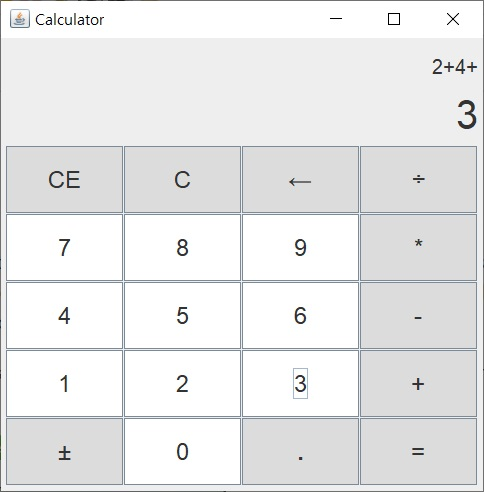

# Calculator
This Java Calculator app is GUI application using Java Swing library. This app design got inspired by Window Calculator. So this app works very simillar to Window Calculator.  recent version 1.0.1

## Features
- This is a standard calculator app. It calculates arithmetic operations.
- This app calculates does not concern priority of calculation. It calculates left to right.
  For example, 3+2×3+2 = 17, not 11.
- If number has devided by zero, it shows "Can't devide by zero". And four operations, ±, and dot buttons become disabled.
  If any button pressed, those buttons become enabled again.
  
## Getting started
This application is writtend in java programming language. The source is calculator.java. If you want to open this file and edit, use eclipse.
If you want to just run this application, you must install [jre](https://java.com/ko/download/) first. And run calculator.jar file. Then calculator gui will show up.
